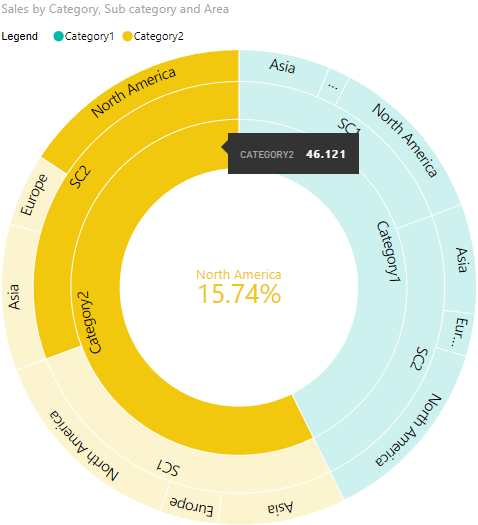
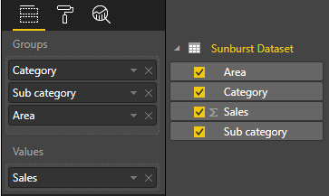
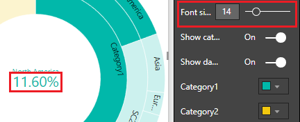
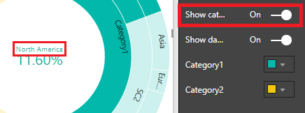
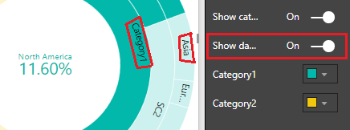
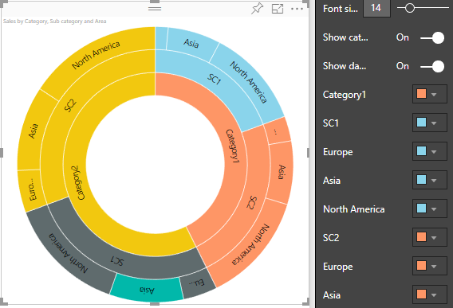

# powerbi-visuals-sunburst
 

Sunburst is a multilevel donut chart, used to visualize hierarchical data, depicted by concentric circles.

# Overview
Sunburst chart is used to visualize hierarchical data, depicted by concentric circles. The circle in the centre represents the root node, with the hierarchy moving outward from the center. A segment of the inner circle bears a hierarchical relationship to those segments of the outer circle which lie within the angular sweep of the parent segment.

See also [Sunburst chart at Microsoft Office store](https://store.office.com/en-us/app.aspx?assetid=WA104380767&sourcecorrid=dfbfa3b3-75c3-497e-b2b9-ffd93aaca76f&searchapppos=0&ui=en-US&rs=en-US&ad=US&appredirect=false)

### Sunburst has 2 bucket fields: Category, Values.
1. Category - Field with a list of categories for each circle segment. It can accept many values.
2. Values - Field with values for Category field. It can accept one value. Also this field is used for cross filtering with other visuals.

# Selection
You can select any segment of the chart for data filtering. For cleaning of selection you should click outside to "Сlear" button on the right top corner of a visual.

# Settings of Sunburst
### Group
- Font size: size of the label in the center of sunburst (see screenshot):

- Show category label: show category label in the center of the visual

- Show data labels: show text labels inside of arc segments of Sunburst

- Category colors: to change colors of each category of the visual

